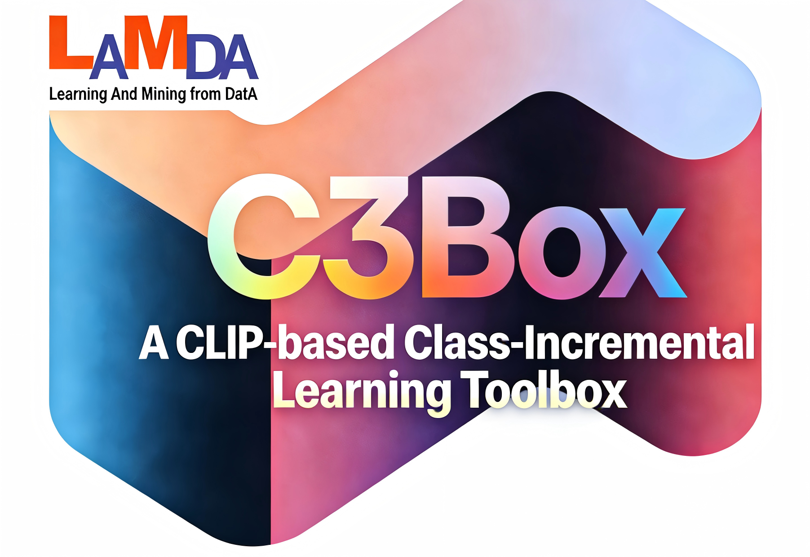

<p align="center">

</p>

<p align="center">
  <a href="#-introduction">🎉Introduction</a> •
  <a href="#-methods-reproduced">🌟Methods Reproduced</a> •
  <a href="#-What's New">📰What's New</a> •
  <a href="#%EF%B8%8F-how-to-use">☄️How to Use</a> •
  <a href="#-acknowledgments">👨‍🏫Acknowledgments</a> •
  <a href="#-contact">🤗Contact</a>
</p>

---

## 🎉 Introduction

Welcome to C3Box, a CLIP-based continual learning toolbox. On the one hand, C3Box implements some state-of-the-art CLIP-based class-incremental learning algorithms, such as CLG-CBM, PROOF, and ENGINE. On the other hand, C3Box also fits typical class-incremental learning algorithms (*e.g.*, FOSTER, and MEMO) and ViT-based class-incremental learning algorithms (*e.g.*, L2P, and DualPrompt) to evaluate their effectiveness.

**If you use any content of this repo for your work, please cite the following bib entries:**

    @article{sun2026c3box,
        title={C3Box: A CLIP-based Class-Incremental Learning Toolbox},
        author={Hao Sun and Da-Wei Zhou},
        journal={arXiv preprint arXiv:2601.20852},
        year={2026}
    }

    @inproceedings{zhou2024continual,
        title={Continual learning with pre-trained models: A survey},
        author={Zhou, Da-Wei and Sun, Hai-Long and Ning, Jingyi and Ye, Han-Jia and Zhan, De-Chuan},
        booktitle={IJCAI},
        pages={8363-8371},
        year={2024}
    }

    @article{zhou2024class,
        author = {Zhou, Da-Wei and Wang, Qi-Wei and Qi, Zhi-Hong and Ye, Han-Jia and Zhan, De-Chuan and Liu, Ziwei},
        title = {Class-Incremental Learning: A Survey},
        journal={IEEE Transactions on Pattern Analysis and Machine Intelligence},
        volume={46},
        number={12},
        pages={9851--9873},
        year = {2024}
    }

## 📰 What's New
- [2026-01]🌟 Release the code.

## 🌟 Methods Reproduced

- `FineTune`: Baseline method which simply updates parameters on new tasks.
- `ZS-CLIP`: Baseline method which serves as a performance benchmark for the pre-trained CLIP on downstream tasks.
- `FOSTER`: Feature Boosting and Compression for Class-incremental Learning. ECCV 2022 [[paper](https://arxiv.org/abs/2204.04662)]
- `MEMO`: A Model or 603 Exemplars: Towards Memory-Efficient Class-Incremental Learning. ICLR 2023 Spotlight [[paper](https://openreview.net/forum?id=S07feAlQHgM)]
- `L2P`: Learning to Prompt for Continual Learning. CVPR 2022 [[paper](https://arxiv.org/abs/2112.08654)]
- `DualPrompt`: DualPrompt: Complementary Prompting for Rehearsal-free Continual Learning. ECCV 2022 [[paper](https://arxiv.org/abs/2204.04799)]
- `CODA-Prompt`: CODA-Prompt: COntinual Decomposed Attention-based Prompting for Rehearsal-Free Continual Learning. CVPR 2023 [[paper](https://arxiv.org/abs/2211.13218)]
- `Ease`: Expandable Subspace Ensemble for Pre-Trained Model-Based Class-Incremental Learning. CVPR 2024 [[paper](https://arxiv.org/abs/2403.12030)]
- `SimpleCIL`: Revisiting Class-Incremental Learning with Pre-Trained Models: Generalizability and Adaptivity are All You Need. IJCV 2024 [[paper](https://arxiv.org/abs/2303.07338)]
- `APER`: Revisiting Class-Incremental Learning with Pre-Trained Models: Generalizability and Adaptivity are All You Need. IJCV 2024 [[paper](https://arxiv.org/abs/2303.07338)]
- `TUNA`: Integrating Task-Specific and Universal Adapters for Pre-Trained Model-based Class-Incremental Learning. ICCV 2025 [[paper](https://arxiv.org/abs/2508.08165)]
- `RAPF`: Class-Incremental Learning with CLIP: Adaptive Representation Adjustment and Parameter Fusion. ECCV 2024 [[paper](https://arxiv.org/abs/2407.14143)]
- `MG-CLIP`: Mind the Gap: Preserving and Compensating for the Modality Gap in CLIP-Based Continual Learning. ICCV 2025 [[paper](https://arxiv.org/abs/2507.09118)]
- `CLG-CBM`: Language Guided Concept Bottleneck Models for Interpretable Continual Learning. CVPR 2025 [[paper](https://arxiv.org/abs/2503.23283)]
- `PROOF`: Learning without Forgetting for Vision-Language Models. TPAMI 2025 [[paper](https://arxiv.org/abs/2305.19270)]
- `ENGINE`: External Knowledge Injection for CLIP-Based Class-Incremental Learning. ICCV 2025 [[paper](https://arxiv.org/abs/2503.08510)]
- `BOFA`: BOFA: Bridge-Layer Orthogonal Low-Rank Fusion for CLIP-Based Class-Incremental Learning. AAAI 2026 [[paper](https://arxiv.org/abs/2511.11421)]

## ☄️ how to use

### 🕹️ Clone

Clone this GitHub repository:

```
git clone https://github.com/LAMDA-CL/C3Box
cd LAMDA-C3Box
```

### 🗂️ Dependencies

1. [torch 2.0.1](https://github.com/pytorch/pytorch)
2. [torchvision 0.15.2](https://github.com/pytorch/vision)
3. [timm 0.6.12](https://github.com/huggingface/pytorch-image-models)
4. [tqdm](https://github.com/tqdm/tqdm)
5. [numpy](https://github.com/numpy/numpy)
6. [scipy](https://github.com/scipy/scipy)
7. [easydict](https://github.com/makinacorpus/easydict)
8. [open-clip 2.17.1](https://github.com/mlfoundations/open_clip/releases/tag/v2.17.1)


### 🔑 Run experiment

1. Edit the `[MODEL NAME].json` file for global settings and hyperparameters.
2. Run:

    ```bash
    python main.py --config=./exps/[MODEL NAME].json
    ```

3. `hyper-parameters`

    When using C3Box, you can edit the global parameters and algorithm-specific hyper-parameter in the corresponding json file.

    These parameters include:

   - **model_name**: The model's name should be selected from the 11 methods listed above, *i.e.*, `finetune`, `zs_clip`, `foster`, `memo`, `simplecil`, `l2p`, `dual`, `coda`, `ease`, `aper`, `tuna`, `rapf`, `clg_cbm`, `mg_clip`, `proof`, `engine` and `bofa`.
   - **init_cls**: The number of classes in the initial incremental stage. As the configuration of CIL includes different settings with varying class numbers at the outset, our framework accommodates diverse options for defining the initial stage.
   - **increment**: The number of classes in each incremental stage $i$, $i$ > 1. By default, the number of classes is equal across all incremental stages.
   - **backbone_type**: The backbone network of the incremental model. It can be selected from a variety of pre-trained models available in the Timm library, such as **LAION-400M** and **OpenAI**,  for
the CLIP with **ViT-B/16**.
   - **seed**: The random seed is utilized for shuffling the class order. It is set to 1993 by default, following the benchmark setting iCaRL.
   - **fixed_memory**: a Boolean parameter. When set to true, the model will maintain a fixed amount of memory per class. Alternatively, when set to false, the model will preserve dynamic memory allocation per class.
   - **memory_size**: The total number of exemplars in the incremental learning process. If `fixed_memory` is set to false, assuming there are $K$ classes at the current stage, the model will preserve $\left[\frac{{memory-size}}{K}\right]$ exemplars for each class. **ZS-CLIP, SimpleCIL, ADAM, EASE, TUNA, CLG_CBM, MG_CLIP, ENGINE and BOFA do not require exemplars.** Therefore, parameters related to the exemplar are not utilized.
   - **memory_per_class**: If `fixed memory` is set to true, the model will preserve a fixed number of `memory_per_class` exemplars for each class.

### 🔎 Datasets

We have implemented the pre-processing datasets as follows:

- **CIFAR100**: will be automatically downloaded by the code.
- **CUB200**: Google Drive: [link](https://drive.google.com/file/d/1XbUpnWpJPnItt5zQ6sHJnsjPncnNLvWb/view?usp=sharing) or OneDrive [link](https://entuedu-my.sharepoint.com/:u:/g/personal/n2207876b_e_ntu_edu_sg/EVV4pT9VJ9pBrVs2x0lcwd0BlVQCtSrdbLVfhuajMry-lA?e=L6Wjsc)
- **ImageNet-R**: Google Drive: [link](https://drive.google.com/file/d/1SG4TbiL8_DooekztyCVK8mPmfhMo8fkR/view?usp=sharing) or Onedrive: [link](https://entuedu-my.sharepoint.com/:u:/g/personal/n2207876b_e_ntu_edu_sg/EU4jyLL29CtBsZkB6y-JSbgBzWF5YHhBAUz1Qw8qM2954A?e=hlWpNW)
- **ObjectNet**: Onedrive: [link](https://entuedu-my.sharepoint.com/:u:/g/personal/n2207876b_e_ntu_edu_sg/EZFv9uaaO1hBj7Y40KoCvYkBnuUZHnHnjMda6obiDpiIWw?e=4n8Kpy) You can also refer to the [filelist](https://drive.google.com/file/d/147Mta-HcENF6IhZ8dvPnZ93Romcie7T6/view?usp=sharing) and processing [code](https://github.com/zhoudw-zdw/RevisitingCIL/issues/2#issuecomment-2280462493) if the file is too large to download.
- **Cars**: Google Drive: [link](https://drive.google.com/file/d/1D8ReAuOPenWi6SMNUrOZhbm6ViyhDHbL/view?usp=sharing  ) or OneDrive: [link](https://njuedu-my.sharepoint.cn/:u:/g/personal/ky2409911_365_nju_edu_cn/EbT1XAstg51Mpy82uHM0D2EBJLrtzmr_V64jeBRjqyyTnQ?e=h6g1rM)
- **UCF**: Google Drive: [link](https://drive.google.com/file/d/1Ng4w310_VDqpKbc7eYaumXTOiDxI02Wc/view?usp=sharing) or OneDrive: [link](https://njuedu-my.sharepoint.cn/:u:/g/personal/ky2409911_365_nju_edu_cn/EU2qHQXjASdLh1jIl6ihZmcB6G2KvqmSw-sTlZKDE6xPbg?e=7ezvTr)
- **Aircraft**: Google Drive: [link](https://drive.google.com/file/d/1xI5r1fU0d6Nff51HuOo5w-e4sGEP46Z2/view?usp=drive_link) or OneDrive: [link](https://njuedu-my.sharepoint.cn/:u:/g/personal/ky2409911_365_nju_edu_cn/ETVliZnmPY9AvZZgcFFJ6jMB2c7TRvcq7-gso2Aqvdl_VQ?e=pWXqdP)
- **Food**: Google Drive: [link](https://drive.google.com/file/d/1rupzXpwrbxki4l-RVmsRawhz1Cm0lDY5/view?usp=drive_link) or OneDrive: [link](https://njuedu-my.sharepoint.cn/:u:/g/personal/ky2409911_365_nju_edu_cn/Eb4xfptD4L5Egus-SiYxrIcBDH1VewLGp4kzyACGF_Na_w?e=duA3Ia)
- **SUN**: OneDrive: [link](https://njuedu-my.sharepoint.cn/:u:/g/personal/ky2409911_365_nju_edu_cn/EcQq1-1pFulKstYtdknB4O8BGo0hnlDRarAwB4wFEgkx0Q?e=YZ0xYV)
- **TV100**: OneDrive: [link](https://njuedu-my.sharepoint.cn/:u:/r/personal/ky2409911_365_nju_edu_cn/Documents/TV100/TV100.zip?csf=1&web=1&e=XNpitj)


> These subsets are sampled from the original datasets. Please note that I do not have the right to distribute these datasets. If the distribution violates the license, I shall provide the filenames instead.

When training **not** on `CIFAR100`, you should specify the folder of your dataset in `utils/data.py`.

```python
    def download_data(self):
        assert 0,"You should specify the folder of your dataset"
        train_dir = '[DATA-PATH]/train/'
        test_dir = '[DATA-PATH]/val/'
```

## 👨‍🏫 Acknowledgments

We thank the following repos providing helpful components/functions in our work.

- [PyCIL](https://github.com/G-U-N/PyCIL)
- [PILOT](https://github.com/LAMDA-CL/LAMDA-PILOT)


## 🤗 Contact

If there are any questions, please feel free to  propose new features by opening an issue or contact with the author: **Hao Sun**([sunhao@lamda.nju.edu.cn](mailto:sunhl@lamda.nju.edu.cn)) and **Da-Wei Zhou**([zhoudw@lamda.nju.edu.cn](mailto:zhoudw@lamda.nju.edu.cn)). Enjoy the code.
